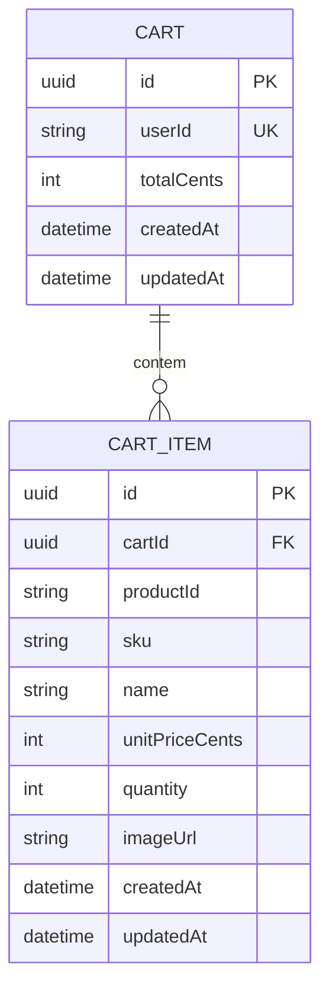

# Data Model — Cart Service

> Documento vivo do modelo de dados. Atualizado sempre que uma entidade for criada, alterada ou removida.
> **Ultima atualizacao:** 2026-06-17

---

## Indice

- [Visao Geral](#visao-geral)
- [Diagrama ER](#diagrama-er)
- [Entidades](#entidades)
- [Indices e Performance](#indices-e-performance)
- [Classificacao de Privacidade](#classificacao-de-privacidade)
- [Decisoes de Modelagem](#decisoes-de-modelagem)

---

## Visao Geral

Modelo de dados centrado em duas entidades relacionadas — `Cart` e `CartItem` — que representam o carrinho de compras ativo de um cliente. Armazenado em PostgreSQL via Sequelize ORM, com fallback para `Map` em memoria quando o banco nao esta disponivel.

**Banco de dados:** PostgreSQL 15
**ORM / acesso:** Sequelize 6
**Extensoes relevantes:** N/A (schemas simples, sem extensoes especiais)

---

## Diagrama ER

---

## Entidades

---

### Cart

> Carrinho de compras ativo de um cliente. Existe um unico carrinho por usuario.

**Tabela:** `carts`
**Servico responsavel:** Cart Service

| Campo | Tipo SQL | Nullable | Default | Descricao |
|-------|----------|----------|---------|-----------|
| `id` | UUID | Nao | uuid_generate_v4() | Identificador unico do carrinho (PK) |
| `userId` | VARCHAR(255) | Nao | — | Identificador do usuario (UK) |
| `totalCents` | INTEGER | Nao | 0 | Soma de `unitPriceCents * quantity` de todos os itens |
| `createdAt` | TIMESTAMPTZ | Nao | NOW() | Data de criacao |
| `updatedAt` | TIMESTAMPTZ | Nao | NOW() | Data da ultima atualizacao |

**Constraints:**
- `PRIMARY KEY (id)`
- `UNIQUE (userId)`

**Relacionamentos:**
- Um `Cart` tem muitos `CartItem` via `cart_items.cartId`

---

### CartItem

> Item individual dentro de um carrinho. Representa um produto com quantidade, precos e metadados visuais.

**Tabela:** `cart_items`
**Servico responsavel:** Cart Service

| Campo | Tipo SQL | Nullable | Default | Descricao |
|-------|----------|----------|---------|-----------|
| `id` | UUID | Nao | uuid_generate_v4() | Identificador unico do item (PK) |
| `cartId` | UUID | Nao | — | Chave estrangeira para `carts.id` |
| `productId` | VARCHAR(255) | Nao | — | ID do produto no Catalog Service |
| `sku` | VARCHAR(100) | Sim | — | SKU do produto |
| `name` | VARCHAR(255) | Sim | — | Nome do produto (cache do catalog) |
| `unitPriceCents` | INTEGER | Sim | — | Preco unitario em centavos no momento da adicao |
| `quantity` | INTEGER | Nao | 1 | Quantidade do produto |
| `imageUrl` | TEXT | Sim | NULL | URL da imagem do produto |
| `createdAt` | TIMESTAMPTZ | Nao | NOW() | Data de criacao |
| `updatedAt` | TIMESTAMPTZ | Nao | NOW() | Data da ultima atualizacao |

**Constraints:**
- `PRIMARY KEY (id)`
- `FOREIGN KEY (cartId) REFERENCES carts(id) ON DELETE CASCADE`

**Relacionamentos:**
- Muitos `CartItem` pertencem a um `Cart` via `cart_items.cartId`

---

## Enums e Dominio de Valores

N/A — O dominio do Cart Service nao possui enums. `quantity` deve ser sempre maior que zero e `unitPriceCents` deve ser maior ou igual a zero.

---

## Indices e Performance

| Indice | Tabela | Campos | Tipo | Motivo |
|--------|--------|--------|------|--------|
| `carts_pkey` | `carts` | `id` | BTREE (PK) | Identificacao unica do carrinho |
| `carts_user_id_key` | `carts` | `userId` | BTREE (UK) | Busca de carrinho por usuario |
| `cart_items_pkey` | `cart_items` | `id` | BTREE (PK) | Identificacao unica do item |
| `idx_cart_items_cart` | `cart_items` | `cartId` | BTREE | FK lookup ao carregar itens de um carrinho |

---

## Classificacao de Privacidade

> Classifique cada campo sensivelmente de acordo com LGPD / GDPR.

| Campo | Tabela | Classificacao | Justificativa |
|-------|--------|---------------|---------------|
| `userId` | `carts` | Pessoal | Identificador direto do usuario |
| `name` | `cart_items` | Publico derivado | Dado de produto replicado |

**Regras gerais:**
- Campos marcados como **Pessoal** so sao retornados ao proprio usuario autenticado
- Campos marcados como **Publico derivado** podem aparecer em respostas de API

---

## Decisoes de Modelagem

### ADR-DM-001 — Migracao de Map em memoria para PostgreSQL com Sequelize

| Campo | Detalhe |
|-------|---------|
| **Status** | Concluida |
| **Data** | 2026-06-17 |
| **Contexto** | Prototipo inicial usava `Map<string, Cart>` em memoria, mas dados sao perdidos ao reiniciar o servico. Necessario armazenamento persistente para ambiente de producao. |
| **Decisao** | Substituir `Map` por PostgreSQL com Sequelize ORM. Estrategia de fallback: se `DATABASE_URL` nao estiver configurada ou a conexao falhar, o servico opera em modo in-memory. |
| **Alternativas consideradas** | Manter apenas `Map` (descartado por falta de persistencia), usar Redis como unico storage (descartado por complexidade de consultas). |
| **Consequencias** | Dados persistem entre restart. Codigo do servico foi adaptado para usar Sequelize com strategy pattern (DB ou in-memory). |

### ADR-DM-002 — CartItem como tabela separada com FK para Cart

| Campo | Detalhe |
|-------|---------|
| **Status** | Concluida |
| **Data** | 2026-06-17 |
| **Contexto** | No storage em memoria, `CartItem` era array embutido no objeto `Cart`. Para PostgreSQL, necessario normalizar. |
| **Decisao** | Criar tabela `cart_items` com `cartId` como chave estrangeira para `carts.id`, com `ON DELETE CASCADE`. |
| **Alternativas consideradas** | Manter JSONB embutido (descartado por falta de indexacao e consultas flexiveis). |
| **Consequencias** | Operacoes de leitura do carrinho agora usam `include` com `hasMany`. |

### ADR-DM-003 — UUID como PK em vez de userId

| Campo | Detalhe |
|-------|---------|
| **Status** | Concluida |
| **Data** | 2026-06-17 |
| **Contexto** | Modelo anterior usava `userId` como PK da tabela `carts`. |
| **Decisao** | Usar UUID como PK (`carts.id`) e manter `userId` como UNIQUE. Isso desacopla o identificador interno do identificador de negocio. |
| **Consequencias** | FK de `cart_items` referencia `carts.id` (UUID) em vez de `carts.userId`. |
