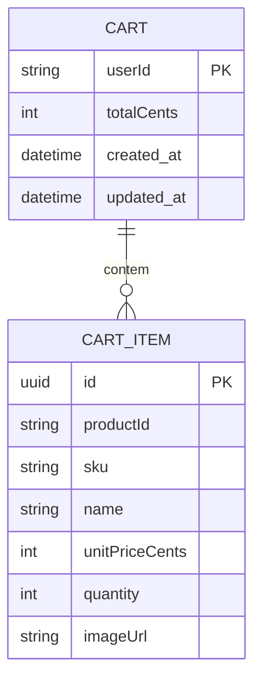

# Data Model — Cart Service

> Documento vivo do modelo de dados. Atualizado sempre que uma entidade for criada, alterada ou removida.
> **Ultima atualizacao:** 2026-06-16

---

## Indice

- [Visao Geral](#visao-geral)
- [Diagrama ER](#diagrama-er)
- [Entidades](#entidades)
- [Indices e Performance](#indices-e-performance)
- [Classificacao de Privacidade](#classificacao-de-privacidade)
- [Decisoes de Modelagem](#decisoes-de-modelagem)

---

## Visao Geral

Modelo de dados centrado em uma unica entidade — `Cart` — que representa o carrinho de compras ativo de um cliente. O carrinho contem uma lista de itens embutidos (`CartItem[]`) e o total em centavos. Atualmente armazenado em `Map` na memoria, com migracao em andamento para PostgreSQL.

**Banco de dados:** PostgreSQL 15 (em migracao — atualmente in-memory `Map`)
**ORM / acesso:** Sequelize 6
**Extensoes relevantes:** N/A (schemas simples, sem extensoes especiais)

---

## Diagrama ER

> Nota: `CartItem` e uma entidade embutida — atualmente armazenada como array dentro do `Cart` no `Map`. Na migracao para PostgreSQL, passara a ser uma tabela separada com chave estrangeira para `Cart`.

---

## Entidades

---

### Cart

> Carrinho de compras ativo de um cliente. Existe um unico carrinho por usuario.

**Tabela:** `carts`
**Servico responsavel:** Cart Service

| Campo | Tipo SQL | Nullable | Default | Descricao |
|-------|----------|----------|---------|-----------|
| `user_id` | VARCHAR(255) | Nao | — | Identificador do usuario (PK) |
| `total_cents` | INTEGER | Nao | 0 | Soma de `unitPriceCents * quantity` de todos os itens |
| `created_at` | TIMESTAMPTZ | Nao | NOW() | Data de criacao |
| `updated_at` | TIMESTAMPTZ | Nao | NOW() | Data da ultima atualizacao |

**Constraints:**
- `PRIMARY KEY (user_id)`

**Relacionamentos:**
- Um `Cart` tem muitos `CartItem` via `cart_items.cart_user_id`

---

### CartItem (entidade embutida)

> Item individual dentro de um carrinho. Representa um produto com quantidade, precos e metadados visuais.

**Tabela:** `cart_items` (prevista na migracao para PostgreSQL)
**Servico responsavel:** Cart Service

| Campo | Tipo SQL | Nullable | Default | Descricao |
|-------|----------|----------|---------|-----------|
| `id` | UUID | Nao | uuid_generate_v4() | Identificador unico do item |
| `cart_user_id` | VARCHAR(255) | Nao | — | Chave estrangeira para `carts.user_id` |
| `product_id` | VARCHAR(255) | Nao | — | ID do produto no Catalog Service |
| `sku` | VARCHAR(100) | Nao | — | SKU do produto |
| `name` | VARCHAR(255) | Nao | — | Nome do produto (cache do catalog) |
| `unit_price_cents` | INTEGER | Nao | — | Preco unitario em centavos no momento da adicao |
| `quantity` | INTEGER | Nao | 1 | Quantidade do produto |
| `image_url` | TEXT | Sim | NULL | URL da imagem do produto |
| `created_at` | TIMESTAMPTZ | Nao | NOW() | Data de criacao |
| `updated_at` | TIMESTAMPTZ | Nao | NOW() | Data da ultima atualizacao |

**Constraints:**
- `PRIMARY KEY (id)`
- `FOREIGN KEY (cart_user_id) REFERENCES carts(user_id) ON DELETE CASCADE`

**Relacionamentos:**
- Muitos `CartItem` pertencem a um `Cart` via `cart_items.cart_user_id`

---

## Enums e Dominio de Valores

N/A — O dominio do Cart Service nao possui enums. `quantity` deve ser sempre maior que zero e `unitPriceCents` deve ser maior ou igual a zero.

---

## Indices e Performance

| Indice | Tabela | Campos | Tipo | Motivo |
|--------|--------|--------|------|--------|
| `idx_cart_user_id` | `carts` | `user_id` | BTREE (PK) | Busca de carrinho por usuario |
| `idx_cart_items_cart` | `cart_items` | `cart_user_id` | BTREE | FK lookup ao carregar itens de um carrinho |

---

## Classificacao de Privacidade

> Classifique cada campo sensivelmente de acordo com LGPD / GDPR.

| Campo | Tabela | Classificacao | Justificativa |
|-------|--------|---------------|---------------|
| `user_id` | `carts` | Pessoal | Identificador direto do usuario |
| `name` | `cart_items` | Publico derivado | Dado de produto replicado |

**Regras gerais:**
- Campos marcados como **Pessoal** so sao retornados ao proprio usuario autenticado
- Campos marcados como **Publico derivado** podem aparecer em respostas de API

---

## Decisoes de Modelagem

### ADR-DM-001 — Armazenamento em memoria com migracao para PostgreSQL

| Campo | Detalhe |
|-------|---------|
| **Status** | Aceita |
| **Data** | 2026-06-01 |
| **Contexto** | Necessidade de prototipar o servico rapidamente sem configurar banco de dados. |
| **Decisao** | Utilizar `Map<string, Cart>` em memoria como storage inicial, com estrutura de dados que espelha o schema PostgreSQL planejado. |
| **Alternativas consideradas** | SQLite (descartado por ser diferente do banco de producao), iniciar direto com PostgreSQL (descartado por complexidade inicial). |
| **Consequencias** | Dados sao perdidos ao reiniciar o servico. Codigo do servico precisara de adaptacao para usar Sequelize. |

### ADR-DM-002 — CartItem como entidade embutida (array)

| Campo | Detalhe |
|-------|---------|
| **Status** | Aceita |
| **Data** | 2026-06-01 |
| **Contexto** | No storage em memoria, itens do carrinho sao armazenados como array dentro do objeto `Cart`. |
| **Decisao** | Manter `CartItem` como sub-entidade embutida no `Cart` enquanto o storage for `Map`. Na migracao para PostgreSQL, `CartItem` passara a ser uma tabela separada com FK para `Cart`. |
| **Alternativas consideradas** | Tabela separada desde o inicio (inviavel com `Map`). |
| **Consequencias** | Mudanca de paradigma de acesso a dados durante a migracao: de `cart.items.find(...)` para `CartItem.findAll({ where: { cartUserId } })`. |
