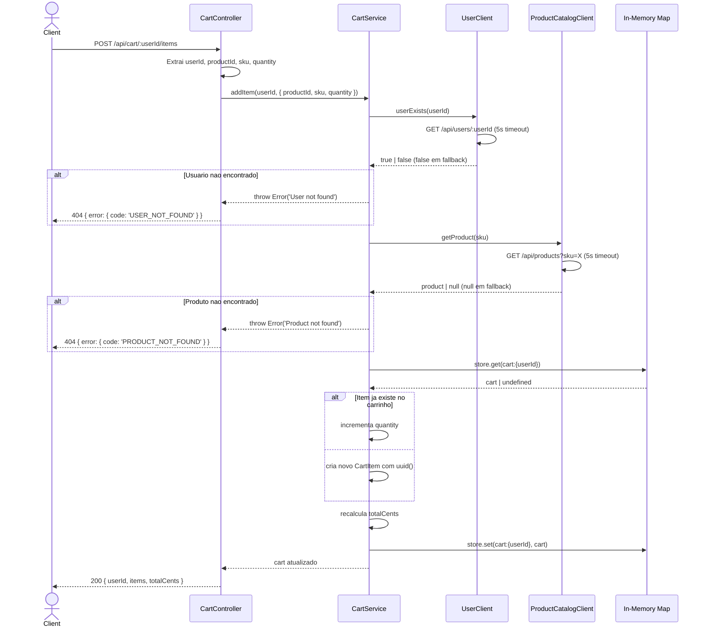

# System Feature Flows

> Registro historico e incremental dos fluxos internos de cada funcionalidade.
> Este documento cresce a cada nova feature implementada e **nunca tem secoes removidas**.

---

## Indice

- [Visao Geral da Arquitetura](#visao-geral-da-arquitetura)
- [Convencoes deste Documento](#convencoes-deste-documento)
- [Feature: Gerenciamento de Carrinho](#feature-gerenciamento-de-carrinho)
- [Feature: Validacao Externa](#feature-validacao-externa)

---

## Visao Geral da Arquitetura

Arquitetura em camadas com Express, seguindo o padrao `routes → controllers → services`.

**Padrao arquitetural:** Layered Architecture (3 camadas)

**Fluxo global de uma requisicao:**

```
HTTP Request
    └── Routes (roteamento)
            └── Controller (validacao leve + delegacao)
                    └── Service (logica de negocio + integracoes)
                            ├── In-memory Map (storage atual)
                            └── HTTP Clients (Product Catalog + User)
```

**Camadas e responsabilidades:**

| Camada       | Responsabilidade                                                  |
|--------------|-------------------------------------------------------------------|
| `routes`     | Definir rotas e associar handlers do controller                   |
| `controllers`| Receber requisicoes, delegar ao service, formatar resposta        |
| `services`   | Logica de negocio, validacoes externas, persistencia              |

---

## Convencoes deste Documento

- **Erros de negocio** sao lancados como `new Error('mensagem')` e capturados no controller para conversao em erro HTTP padronizado
- **Clientes HTTP** possuem fallback silencioso: falha de rede retorna `null` ou `false`
- **IDs de requisicao** sao propagados via middleware `X-Request-ID`
- **Respostas de erro** seguem envelope unico: `{ data: null, error: { code, message }, meta: { requestId } }`

---

---

# Feature: Gerenciamento de Carrinho

> **Versao:** 1.0.0
> **Implementada em:** 2026-06-01
> **Status:** Concluida

---

## Resumo

Permite que usuarios gerenciem seu carrinho de compras ativo: adicionar produtos, remover itens, visualizar o conteudo e limpar o carrinho por completo. Cada usuario possui exatamente um carrinho ativo.

**Motivacao:** Necessidade de um carrinho de compras stateful por cliente, integrado ao ecossistema de microservicos de e-commerce.
**Resultado:** API REST funcional com 4 endpoints de carrinho, armazenamento em memoria e validacao externa de produtos e usuarios.

---

## Fluxo Principal

### 1. Ponto de Entrada

- **Tipo:** HTTP REST
- **Arquivo:** `src/routes/cart.routes.js`
- **Rota/Evento:**
  - `GET /api/cart/:userId` — Obter carrinho
  - `POST /api/cart/:userId/items` — Adicionar item
  - `DELETE /api/cart/:userId/items/:productId` — Remover item
  - `DELETE /api/cart/:userId` — Limpar carrinho
- **Autenticacao:** N/A (sem autenticacao implementada — userId via path param)

---

### 2. Validacao de Entrada

- **Arquivo:** `src/controllers/cart.controller.js`
- **Biblioteca:** N/A (validacao manual no controller)

| Campo | Tipo | Obrigatorio | Regra de validacao |
|-------|------|-------------|---------------------|
| `productId` | string | Sim | Presente no body do POST `/items` |
| `sku` | string | Nao | Opcional — usado como fallback se `productId` nao for encontrado |
| `quantity` | integer | Nao (default 1) | Deve ser >= 1 |

**Falha de validacao:** Dados invalidos resultam em `400` com codigo `INVALID_REQUEST`.

---

### 3. Orquestracao da Aplicacao

- **Arquivo:** `src/controllers/cart.controller.js`

O controller instancia `CartService` e delega cada operacao:

1. Controller extrai `userId` dos params e dados do `body`
2. Controller chama o metodo correspondente no `CartService`
3. Em caso de erro conhecido (`Product not found`, `User not found`, `Cart not found`), converte para erro HTTP com codigo especifico
4. Retorna o carrinho atualizado como JSON

---

### 4. Regras de Negocio

| Regra | Descricao | Localizacao no Codigo |
|-------|-----------|----------------------|
| Um carrinho por usuario | A chave do Map e `cart:{userId}` | `src/services/cart.service.js:13` |
| Incremento de quantidade | Se o produto ja existe no carrinho, incrementa a quantidade em vez de duplicar | `src/services/cart.service.js:34-36` |
| Calculo de total | `totalCents` e sempre recalculado como soma de `unitPriceCents * quantity` | `src/services/cart.service.js:49` |
| Remocao de item | Remove o item do array pelo `productId`, nao pelo `id` interno | `src/services/cart.service.js:60` |
| Limpeza de carrinho | Remove a chave do `Map` e retorna carrinho vazio | `src/services/cart.service.js:68-69` |

---

### 5. Persistencia / Integracoes

**Repositorios utilizados:**

| Repository | Operacao | Arquivo |
|------------|----------|---------|
| `Map<string, Cart>` (in-memory) | get/set/delete | `src/services/cart.service.js:7` |

**Integracoes externas:**

| Servico | Operacao | Timeout | Retry |
|---------|----------|---------|-------|
| Product Catalog (`:3001`) | `GET /api/products?sku=X` | 5s | Nao (fallback: retorna `null`) |
| User Service (`:3007`) | `GET /api/users/:userId` | 5s | Nao (fallback: retorna `false`) |

---

### 6. Resposta Final

**Sucesso — `2XX`:**

```json
{
  "userId": "user-123",
  "items": [
    {
      "id": "a1b2c3d4-...",
      "productId": "prod-1",
      "sku": "SKU-001",
      "name": "Produto Exemplo",
      "unitPriceCents": 1990,
      "quantity": 2,
      "imageUrl": "https://example.com/img.jpg"
    }
  ],
  "totalCents": 3980
}
```

**Campos retornados:**

| Campo | Tipo | Descricao |
|-------|------|-----------|
| `userId` | string | Identificador do usuario |
| `items` | array | Lista de itens no carrinho |
| `items[].id` | string (UUID) | Identificador unico do item |
| `items[].productId` | string | ID do produto no catalogo |
| `items[].sku` | string | SKU do produto |
| `items[].name` | string | Nome do produto |
| `items[].unitPriceCents` | integer | Preco unitario em centavos |
| `items[].quantity` | integer | Quantidade |
| `items[].imageUrl` | string (nullable) | URL da imagem |
| `totalCents` | integer | Valor total do carrinho em centavos |

---

## Fluxos Alternativos e Erros

| Cenário | HTTP Status | Codigo de Erro | Mensagem |
|---------|-------------|----------------|----------|
| Produto nao encontrado | 404 | `PRODUCT_NOT_FOUND` | Product not found |
| Usuario nao encontrado | 404 | `USER_NOT_FOUND` | User not found |
| Carrinho nao encontrado (ao remover item) | 404 | `CART_NOT_FOUND` | Cart not found |
| Dados invalidos no body | 400 | `INVALID_REQUEST` | Invalid request body |
| Erro interno | 400 | `INTERNAL_ERROR` | Internal server error |

> Todos os erros retornam o mesmo envelope:
> ```json
> { "data": null, "error": { "code": "ERROR_CODE", "message": "..." }, "meta": { "requestId": "uuid" } }
> ```

---

## Diagrama de Sequencia

### Adicionar Item ao Carrinho



---

## Decisoes Tecnicas

### ADR-001 — Armazenamento em Map em memoria

| Campo | Detalhe |
|-------|---------|
| **Status** | Aceita (migrando para PostgreSQL) |
| **Data** | 2026-06-01 |
| **Contexto** | Prototipo rapido sem dependencia de banco de dados. |
| **Decisao** | `Map<string, Cart>` com chave `cart:{userId}`. |
| **Consequencias** | Dados volateis, mas estrutura de dados espelha o schema SQL final, facilitando migracao. |

---

---

# Feature: Validacao Externa

> **Versao:** 1.0.0
> **Implementada em:** 2026-06-01
> **Status:** Concluida

---

## Resumo

Antes de adicionar um item ao carrinho, o servico valida a existencia do usuario no User Service e do produto no Product Catalog Service. Ambos os clients possuem fallback silencioso para evitar que falhas temporarias dos servicos externos quebrem o fluxo.

**Motivacao:** Garantir que apenas produtos e usuarios validos sejam registrados no carrinho, sem depender de consistencia eventual.
**Resultado:** Integracao HTTP resiliente com timeout de 5s e fallback que trata servicos indisponiveis como "nao encontrado".

---

## Fluxo Principal

### 1. Ponto de Entrada

- **Tipo:** Integracao HTTP (chamada interna durante `POST /api/cart/:userId/items`)
- **Arquivos:**
  - `src/services/user.client.js`
  - `src/services/product-catalog.client.js`

---

### 2. Fluxo de Execucao

**UserClient:**

1. Service chama `userClient.userExists(userId)`
2. Client faz `GET /api/users/:userId` no User Service (`:3007`)
3. Se HTTP 200, retorna `true`
4. Se erro (qualquer status ou excecao de rede), retorna `false`
5. Fallback: `false` — usuario tratado como inexistente

**ProductCatalogClient:**

1. Service chama `productClient.getProduct(sku)`
2. Client faz `GET /api/products?sku=X` no Product Catalog (`:3001`)
3. Se resposta e array, busca o produto cujo `sku` corresponde
4. Se encontra, retorna o produto; caso contrario, retorna `null`
5. Fallback: `null` — produto tratado como inexistente

---

### 3. Regras de Negocio

| Regra | Descricao | Localizacao no Codigo |
|-------|-----------|----------------------|
| Usuario deve existir | `addItem` lanca `User not found` se `userExists` retorna `false` | `src/services/cart.service.js:22-24` |
| Produto deve existir | `addItem` lanca `Product not found` se `getProduct` retorna `null` | `src/services/cart.service.js:27-29` |
| Timeout de 5s | Ambos os clients usam `timeout: 5000` no axios | `src/services/product-catalog.client.js:8`, `src/services/user.client.js:7` |
| Fallback silencioso | Excecoes sao capturadas com `catch` vazio e retornam `null`/`false` | `src/services/product-catalog.client.js:16-18`, `src/services/user.client.js:9-11` |

---

### 4. Resposta Final

A validacao externa nao possui resposta propria — seu resultado e incorporado no fluxo de `addItem`:

- Sucesso: fluxo continua normalmente e o item e adicionado ao carrinho
- Falha (`User not found` / `Product not found`): erro 404 retornado ao cliente

---

## Diagrama de Sequencia

O diagrama de sequencia para o fluxo completo de `addItem` (incluindo as validacoes externas) esta documentado na secao [Gerenciamento de Carrinho](#feature-gerenciamento-de-carrinho).

---

## Decisoes Tecnicas

### ADR-002 — Fallback silencioso em clients HTTP

| Campo | Detalhe |
|-------|---------|
| **Status** | Aceita |
| **Data** | 2026-06-01 |
| **Contexto** | Servicos externos podem estar temporariamente indisponiveis (rede, restart, deployment). |
| **Decisao** | Capturar excecoes com `catch` vazio e retornar valor sentinela (`null` / `false`) em vez de propagar o erro. |
| **Consequencias** | Falhas transientes sao tratadas como "recurso nao encontrado". Nao ha distincao entre "servico fora do ar" e "recurso inexistente" — ambos resultam em 404. |
